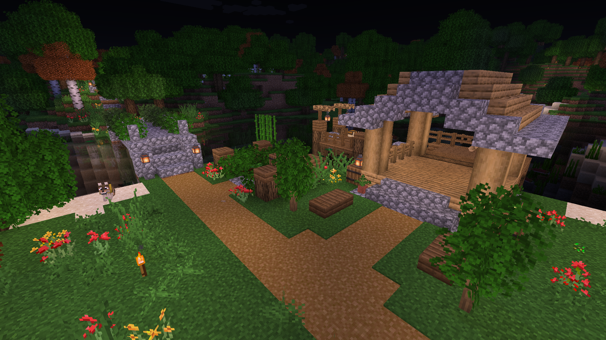

### New Member and Neighborhood Development
This month we've welcomed a new member to the community
and built some minor additions to the neighborhood.
We've also recently begun exploring the world in search of new
resources and building materials.

<figure>

</figure>

### Boat/Fishing Dock
A dock was built on the coast of our yet-unnamed village
to support fishing and better facilitate migration from
the landing settlement into town.
<figure>

<figcaption>Turtlemay's dock by the village creek.</figcaption>
</figure>

### New Resources & Exploration
Four pale oak saplings were obtained from a wandering trader,
introducing a sustained source of pale wood to the world.

<figure>

</figure>

Our first expedition also yielded several more renewable resources
such as cherry trees, dark oak trees, and berry bushes.

<figure>

</figure>

### Creative World Builds
A few incremental additions to our creative map.
<figure>

</figure>

<figure>

<figcaption>Turtlemay's horse stable.</figcaption>
</figure>

<figure>

</figure>

### Engagement & Growth

Our focus thus far has been local community development, slowly
gaining new resources through wandering traders, mining, and
some short expeditions. A major priority going forward will be
inviting more members to the group to maintain some
forward momentum going into our third month!