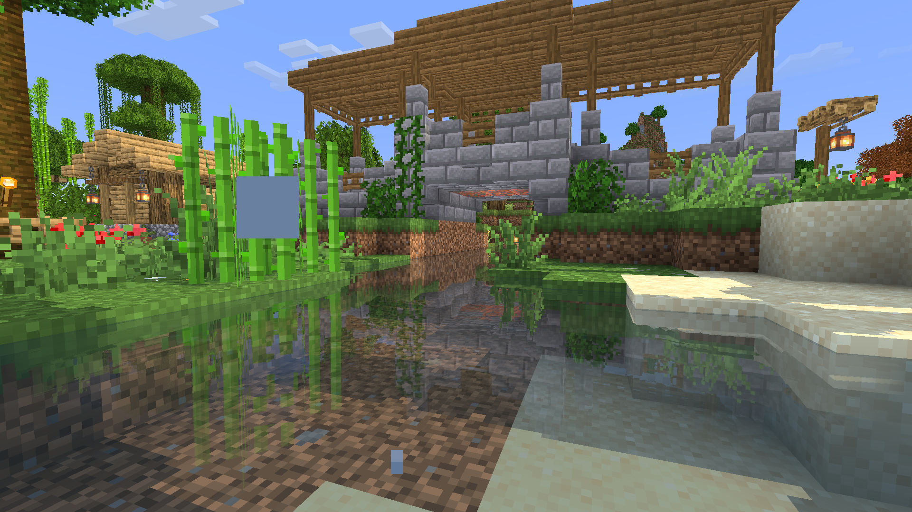
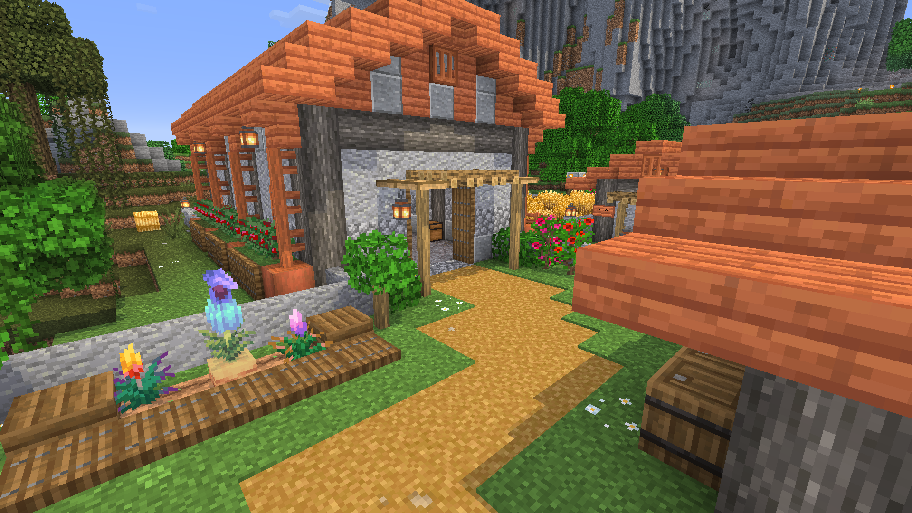

### Municipality & Neighborhood Development
This month we have established the Turtle Grove township consisting of the central arbor village
and adjacent Little Creek Homestead on either side of the creek.

<figure>

</figure>

<figure>

</figure>

A permanent portal was created at Little Creek for nether prospecting.
We have yet to establish a travel nexus, favoring overland migration between settlements.

### Cocoa Greenhouse
A greenhouse for cocoa pods was built at Turtle Grove alongside a small gazebo.
<figure>

</figure>

### Shroom Shack
A mushroom vendor booth serves the road to downtown Pepperton,
supplied by the giant mushroom farm.
<figure>

</figure>

### Park at Little Creek
A small garden park was started near Little Creek with an access bridge from the island.
A small canal was also dredged around the park to allow boat travel further downstream.
The canal bridge re-joins the main arbor town to the homestead,
serving as a transition between the two locations.
<figure>

</figure>

### Farming and Livestock

A new homestead was constructed along the road to the bay island
to support a few armadillos, cows, chickens, sheep, and common crops.
<figure>

</figure>

The homestead punctuates the crossroads between the landing settlement and town to the bay island.
Other proposed plans for this area include an armadillo-powered silverfish farm and a swamp slime ranch.
<figure>

<figcaption>Closer view of homestead from the plateau.</figcaption>
</figure>

A family of armadillos was relocated from their temporary pen
at the top of the plateau to the new farm.
<figure>

</figure>

We have also begun increasing bee populations in several locations across the map.
Next month's docket includes building a central bee farm to enable the harvesting of honey and wax.
<figure>

</figure>

### Mockups & More Planned Projects
Some creative world mockup builds demonstrate potential projects
including a lighthouse and bee farm.
<figure>

</figure>

An idle villager residing at Cape Birke has been enlisted as a cartographer
in hopes of obtaining a trial dungeon map.
Growing our villager population in the future will be a major advancement
toward obtaining more hard-to-find resources.

This month's focus has once again been on local building and development,
slowly accumulating materials from merchants and those few farms we have available.
Our search for new members also continues into Month 4
as activity in the group reaches a near stagnant pace.

The upcoming Spring to Life Update will soon bring more interesting resources to the world
as well as another opportunity for exploration and community growth.