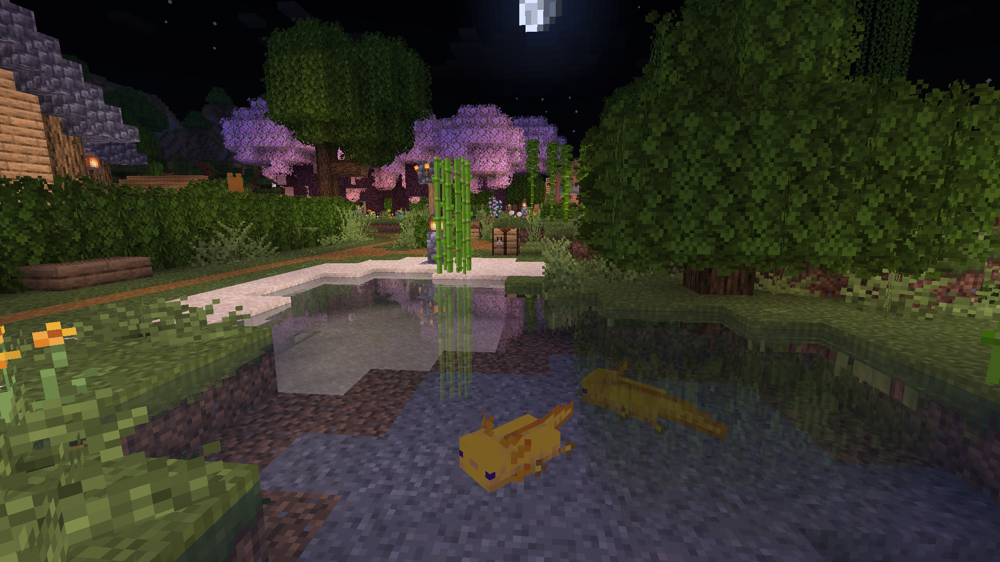
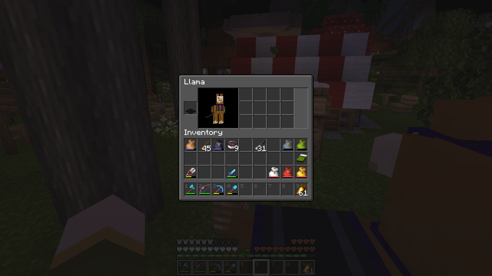

This month we've welcomed a new member to the group,
created a hub for a growing villager population and trading economy,
and developed some more local farms and work areas for expanding the Turtle Grove township.
The locations of an end stronghold and trial dungeon were discovered,
and the *Spring to Life* update also brings a few new decorative details to the world.

<figure>

</figure>

<figure>

</figure>

### Ossuary Bay Island Development
A second villager was rescued and settled on the bay island, bringing the total population to two,
a fisherman and a cartographer.

<figure>

</figure>

### Little Creek Development
Little Creek has gained a few additions and changes including a fishing hut and stable
alongside the ongoing remodeling of some major structures.

<figure>

</figure>

<figure>

</figure>

Improvements were made to both the main bridge leading onto the property
and the access bridge leading to the garden park.

The initial access bridge to the park was also rebuilt to allow boat travel,
matching the design of the previously-constructed canal bridge.
The park's pond was also re-developed for axolotl habitation.

<figure>

</figure>

<figure>

</figure>

### Cave Exploration & Axolotl Breeding
A lush cave and mineshaft were discovered under the waters near Cape Birke.

<figure>

</figure>

More axolotls were relocated from the underground lush cave to a small pond at Turtle Grove,
where they are sustained by tropical fish obtained from wandering merchants.

<figure>

</figure>

### Bee Farming
A bee home was created at Turtle Grove to enable increased honey and wax production.

<figure>

</figure>

### Increasing Villager Population
We have begun the sustained raising of villagers at Turtle Grove,
where the inn serves as their temporary home until they are given their profession.

<figure>

</figure>

The association is first populated by two newly-raised villagers from Pepperton
along with another just rescued at the building site.

<figure>

</figure>

.")

<figure>

</figure>

Residents are supported by the bread produced from a medium-sized wheat field also on the property,
enabling the steady raising of new villagers.

<figure>

</figure>

### Trade Market & Economy
Villagers raised at the inn can be employed at the adjacent trading market,
where a supply of iron obtained from the grinder in Pepperton
yields a steady income of emeralds and other useful items.

<figure>

</figure>

### Dye Shop
A workshop for creating dyes and harvesting colored wool was built at Turtle Grove.
A supply of bone meal and ink sacs can produce all colors on site.

<figure>

</figure>

<figure>

</figure>

### Trial Dungeon Location
A sought-after trial chamber map was finally obtained via a cartographer at the villager trade market.
The dungeon is located beneathe our early settlement in Pepperton.

<figure>

</figure>

### End Stronghold & Portal Search
An end stronghold was located via ender eyes and its portal discovered
after a gruelling trek through its many cells and corridors.
The portal has yet to be opened.

<figure>

</figure>

<figure>

</figure>

### Nether Resources
A short trip through the nether yielded our first nether wart plants
taken from a newly-discovered stronghold as well as our first wither skull.

<figure>

</figure>

<figure>

</figure>

### Sugar Cane, Llamas, and New Resources
A basic sugar cane farm was created in Pepperton,
largely to support librarian trading and book creation.
We have also begun breeding stronger llamas in preparation for long expeditions
and supply runs between settlements.

<figure>

</figure>

Following the *Spring to Life* update, a few more decorative blocks were easily obtained.

<figure>

</figure>

### Adventuring & Future Plans

Following the discovery of the end portal and trial dungeon,
our three active players have some solid potential campaigns lined up for the coming weeks,
also including ocean and woodland treasure hunts obtained from cartographers.

Beyond expanding our villager trading economy, future projects may include a travel nexus,
a raid-proof fort, and more controlled sources of slime and blaze rods.
Our search for new members also continues into our fifth month.