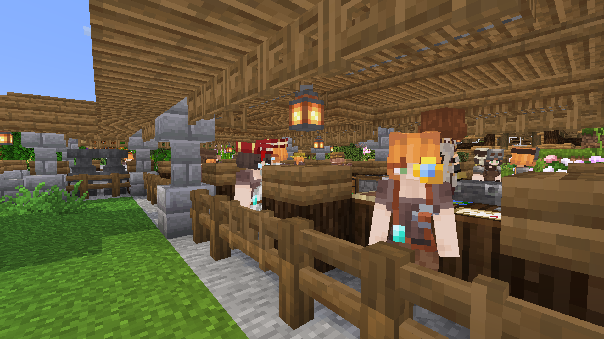
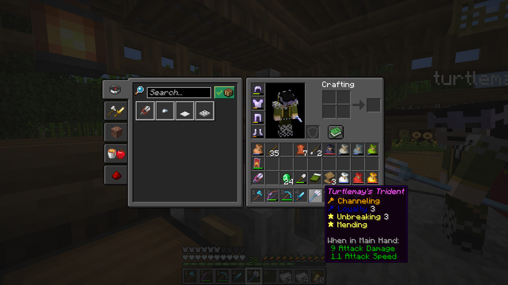

### Market District Expansion
Envisioned as a central trading hub, the market district has been expanded across the creek
into a new developing town designed for all merchants to live and work.
This area is planned to connect back to the original Cape Birke landing site
and serve as an entry point for new settlers.

<figure>

</figure>

We have begun focusing on book trading to enable easier access to essential enchantments
such as mending, infinity, protection, and unbreaking.

### Trouble in Town

Some minor setbacks at the trading hall were remediated with additional lighting and copper rods.

<figure>

</figure>

### Library Building
A library building was created to facilitate larger scale trading of enchanted books.
Future plans for this building include an annex
designed to provide comfortable housing for all the librarians.

<figure>

</figure>

### Enchanted Tridents & Mob Heads
In addition to basic equipment we can also utilize the library to create powerful tridents,
useful as a ranged weapon as well as a way of generating lightning strikes.

<figure>

</figure>

### Briar Hollow
Expanded from the villager inn and market district,
the town of Briar Hollow was established to serve as a central trade hub.
Located near our original landing site and connected to Turtle Grove township by bridge,
it incorporates the newly-built library as well as an iron grinder and armory.

<figure>

</figure>

Some temporary farms provide building supply for new builds.

<figure>

</figure>

Our economy is supported by a second iron grinder at Briar Hollow.
Supplied by the grinder, blacksmiths at the nearby armory provide a steady income of emeralds as well as essential equipment.

The new armory at Briar Hollow provides armor, weapons, and tools as well as an infinite supply of lava.

<figure>

</figure>

### Banner Patterns & More New Resources
The dye shop at Turtle Grove has been equipped for producing decorated banners.
We now have access to the creeper charge as well as the other more common patterns.
Other treasure patterns have yet to be discovered.

<figure>

</figure>

Firefly bushes have been obtained from a wandering merchant,
sure to become a staple for landscaping in all areas.
<figure>

</figure>

A couple of frogs and some new animal variants were wrangled near Cape Birke.
<figure>

</figure>

### More Shenanigans
Some other minor developments around town.

<figure>

</figure>

Nikki's Cafe was opened at Turtle Grove.

<figure>

</figure>

A rare jockey was rescued and promptly dunked on by a naturally-spawning golem.

<figure>

</figure>

### Community Status & Hiatus
Next on the admin docket should be an onboarding guide for new members.
The trading economy at Briar Hollow makes it very easy to get up and running,
and as always, old members are also encouraged to drop in to the world or Discord.

We are currently on a short hiatus through June.
Following this blog post, I will be doing another push for new members
before ramping up again over the next month.