### Dock at Ashwood Landing
A byroad was created near the coast of Briar Hollow to guide travelers into town.
The newly-constructed dock forms the Port of Cape Birke, where new settlers are expected to disembark.

<figure>

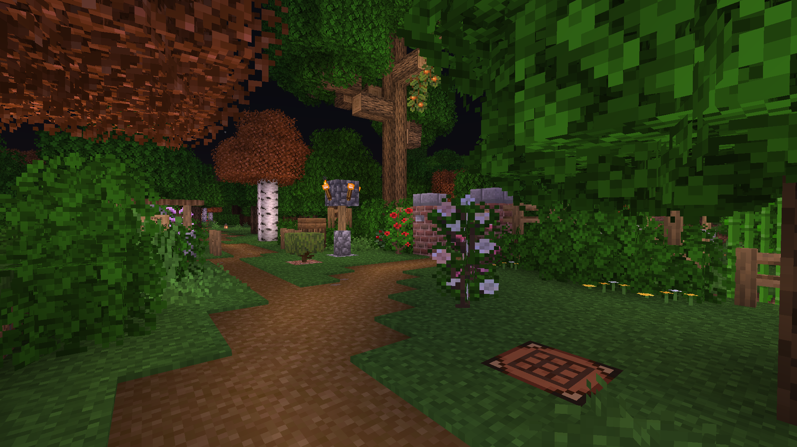
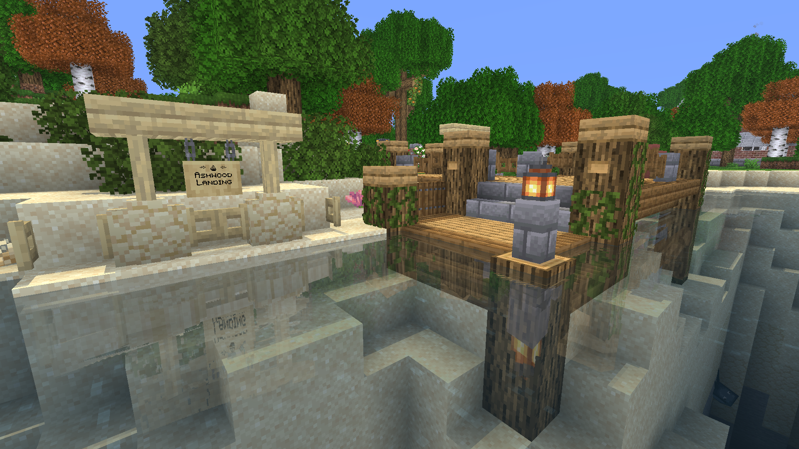

</figure>

### Fortified Village at Rhoeas
To the north of Turtle Grove, the fortress of Rhoeas was established.
Created by missfrancon, this fortified village is home to a number of villagers and animals.
A neighboring grotto opens out into the waterway, leading back to the sandbanks at Pepperton.

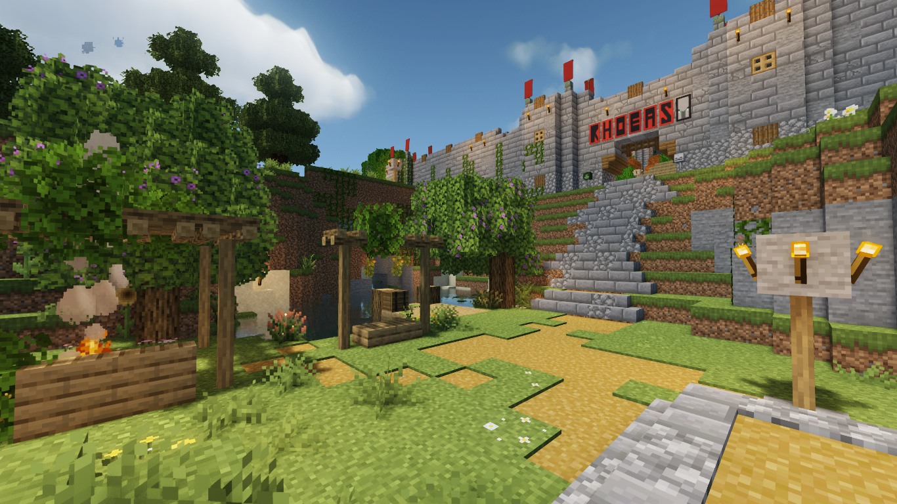

<figure>

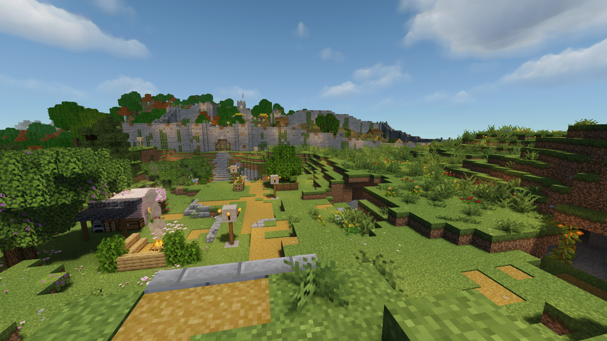
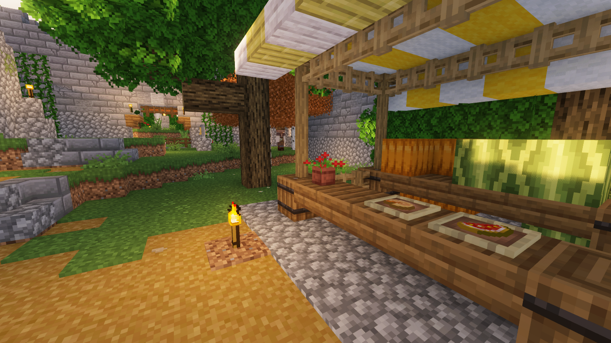
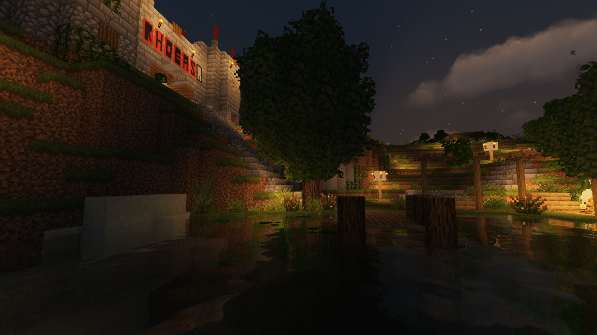
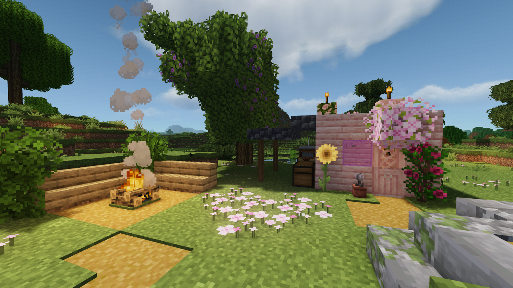

</figure>

The comprehensive protection of the village includes extensive battlements and embrasures on its defensive walls
which also have a traversable interior.

<figure>

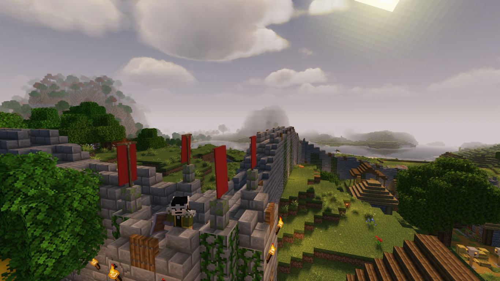
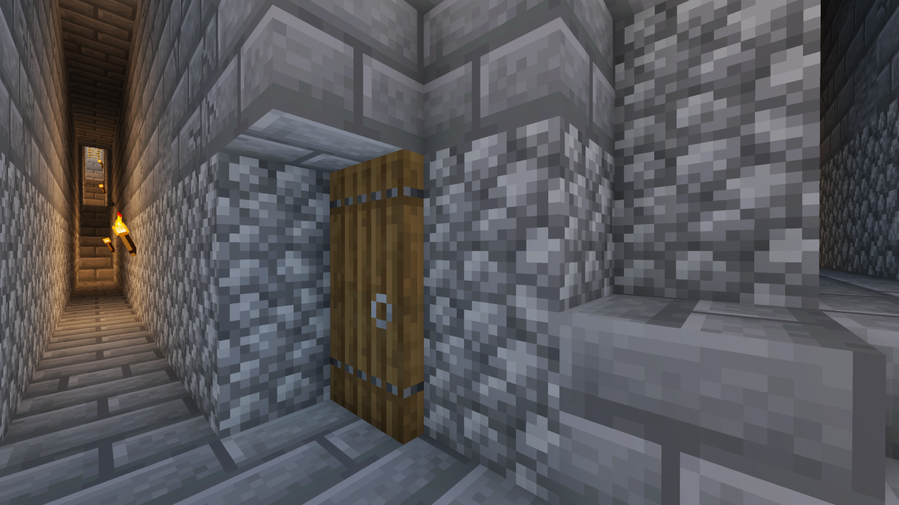

</figure>

### Happy Ghast & Village Raids
Our first dried ghast was obtained via piglin bartering and recovered at Turtle Grove.
Among other uses, the mature ghast can be harnessed for effective land surveying and portage.
<figure>

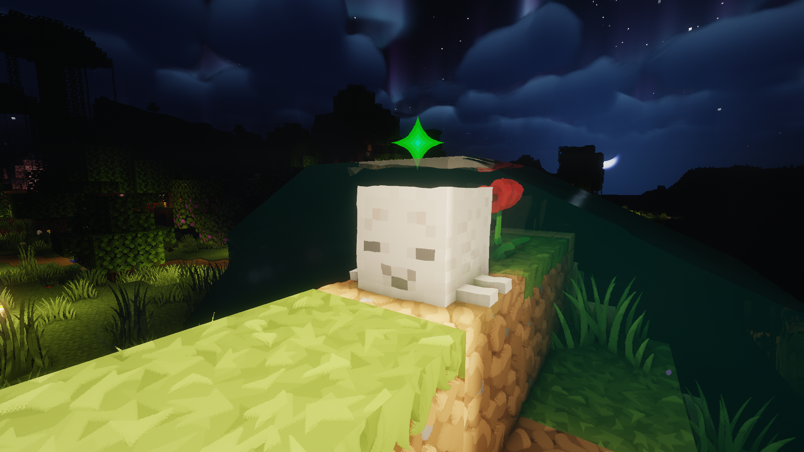
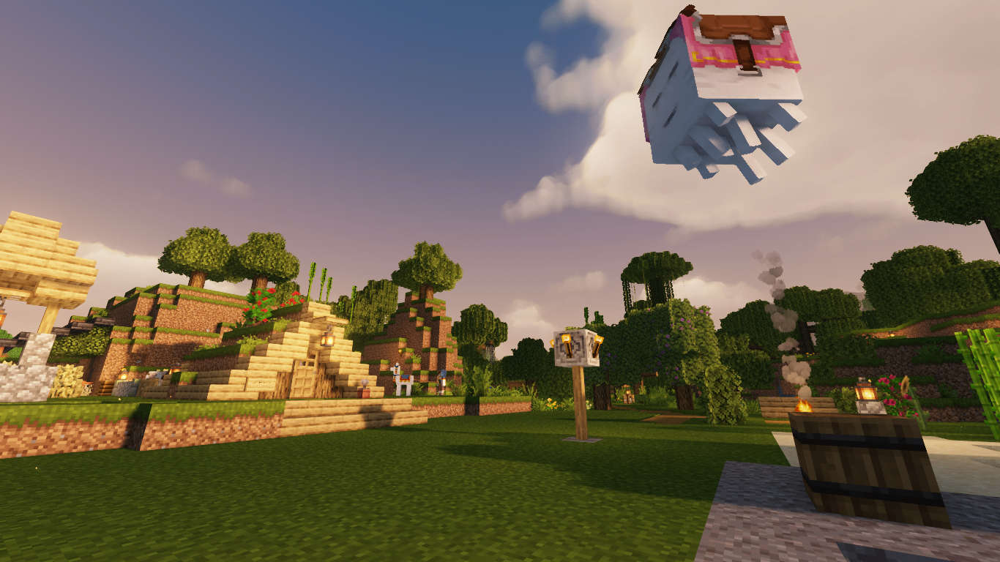

</figure>

Some low-level pillager encounters were enjoined at a nearby village,
yielding a handful of totems, saddles, and banners, and emeralds.
<figure>

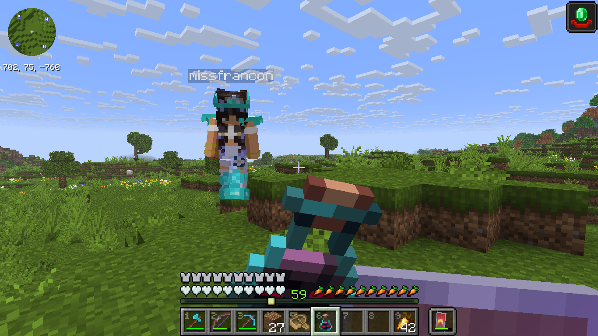
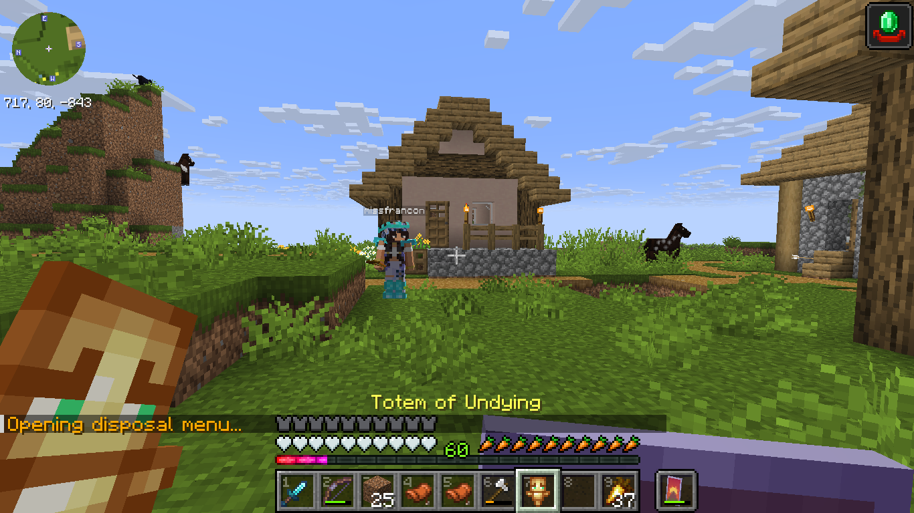

</figure>

### New Wiki & Community Status
We have launched our own community wiki at
[mcw.trtl.in](http://mcw.trtl.in/)
for recording information about our world such as notable locations, guides, and lore.
Community members can register using an email address to contribute.

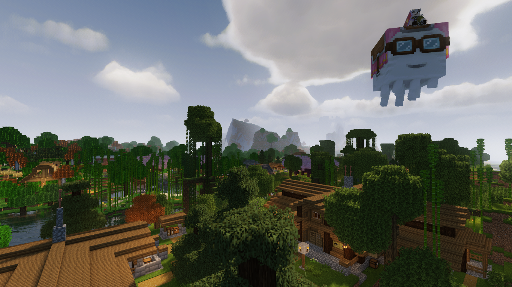

Going into our seventh month, we have created a solid community hub
and—as some members return from hiatus—we are working to fill in the gaps between projects
and build a solid foundation for new members.