This month we have welcomed a new member to the group and made some minor additions to the neighborhood.

<figure>
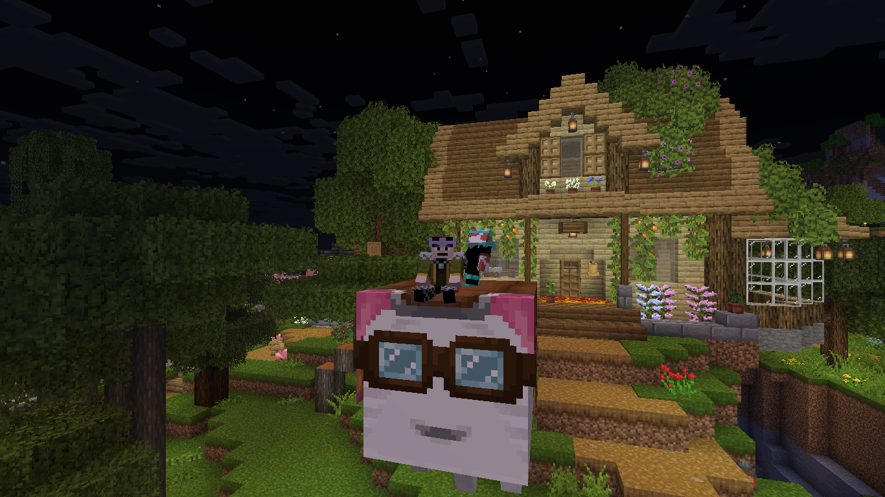

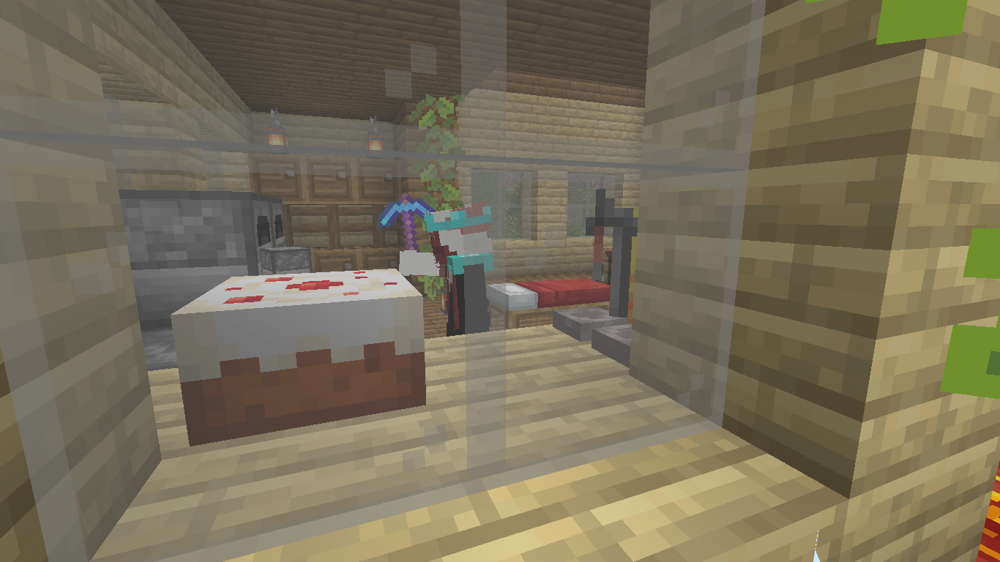
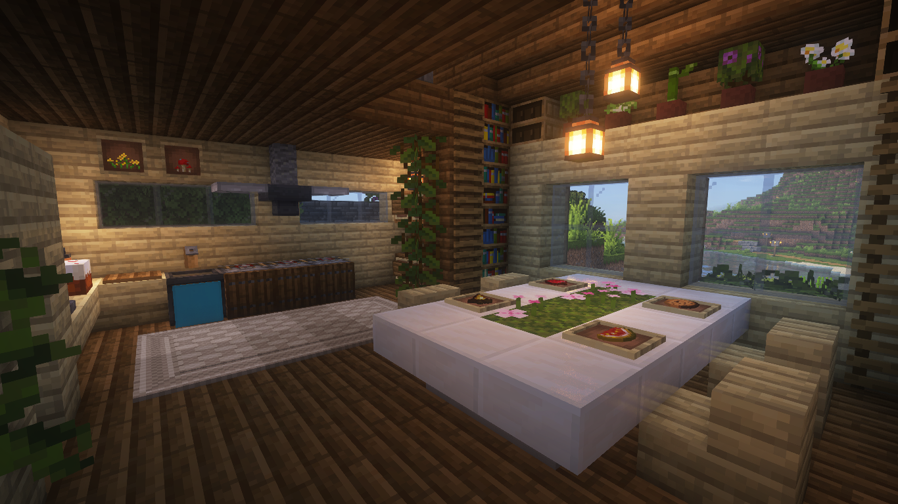

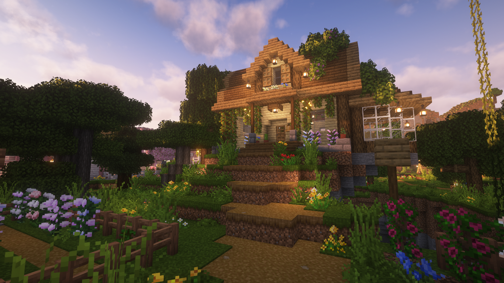
</figure>

### Turtle Grove Conservatory
A plant conservatory was constructed on the outskirts of Pepperton,
envisioned as a center for botanical research.
It overlooks the town from the hilltop.

<figure>

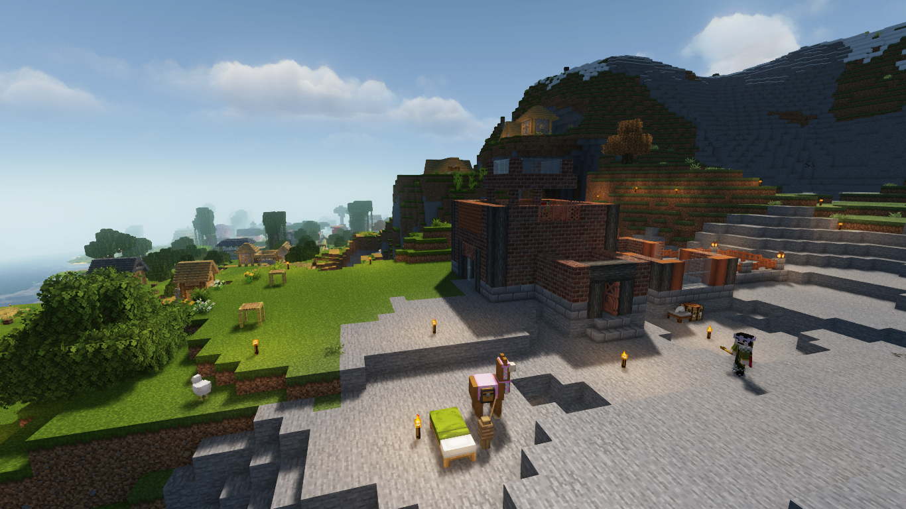
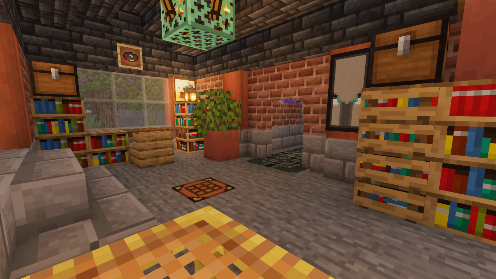
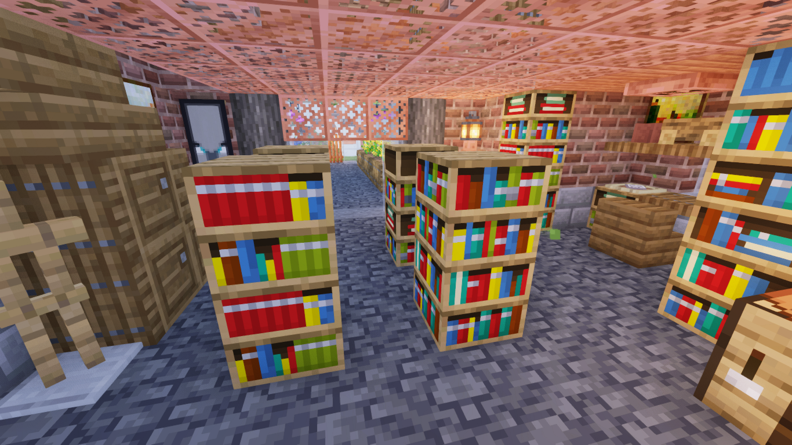
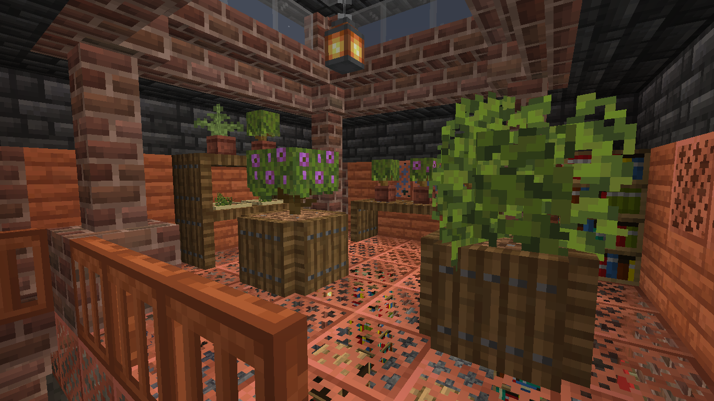
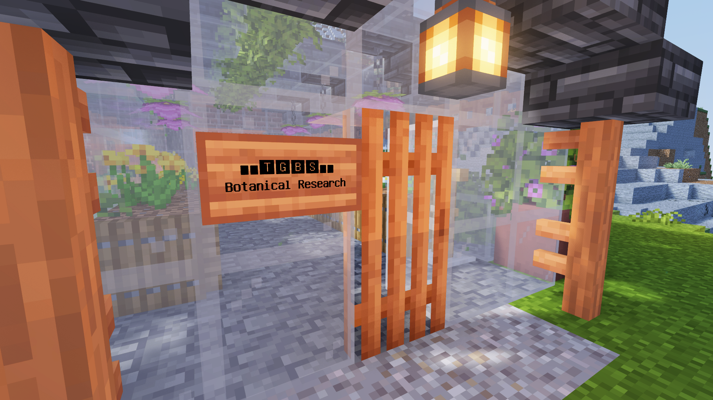

</figure>

### Road to Rhoeas
A dirt road was drawn out between Turtle Grove and the fortified village of Rhoeas for smoother travel
as well as creating an avenue for future neighborhood expansion.

<figure>

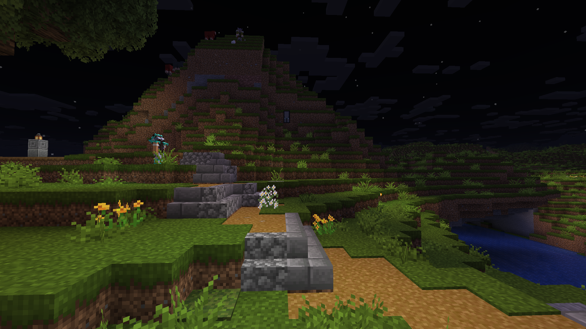

</figure>

### Upcoming Projects
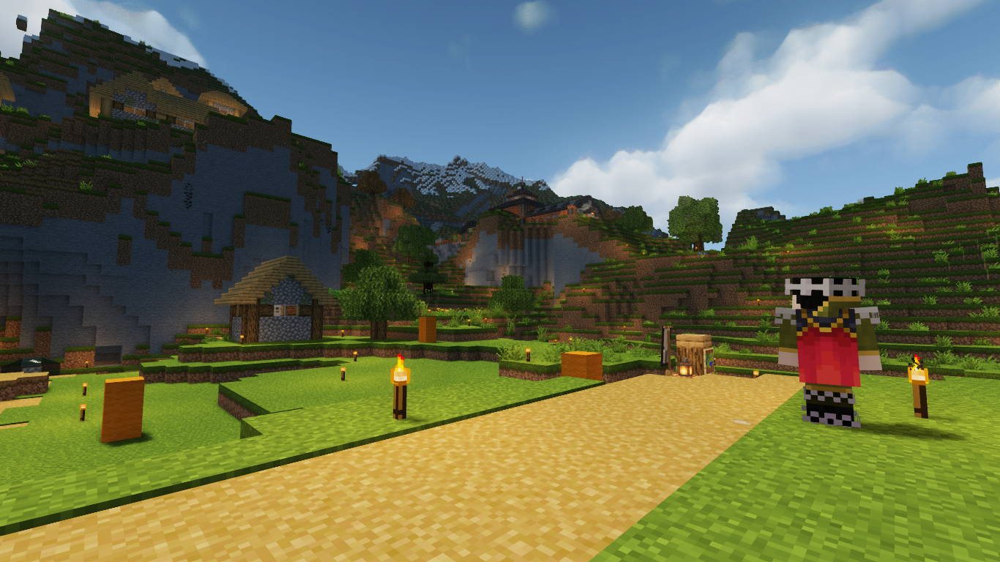

Following a slow month, our upcoming plans include the anticipated Cape Birke lighthouse,
renovations to the Briar Hollow iron grinder as well as further development of the town center.