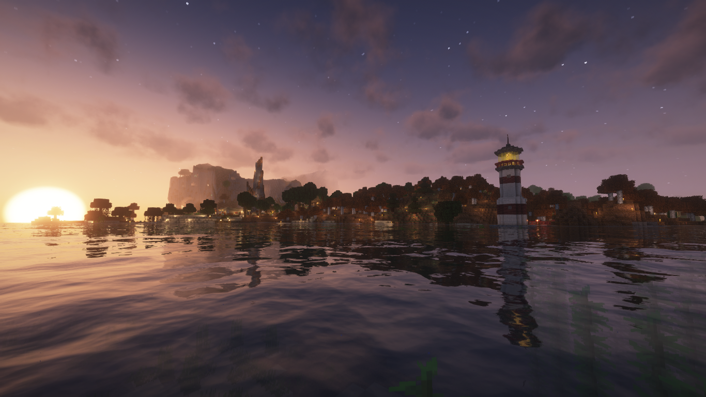
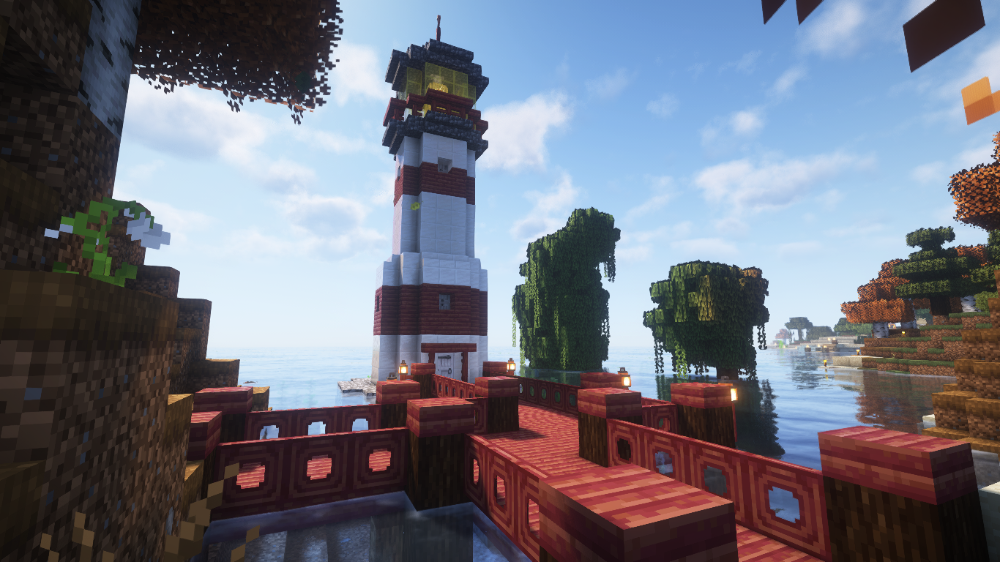
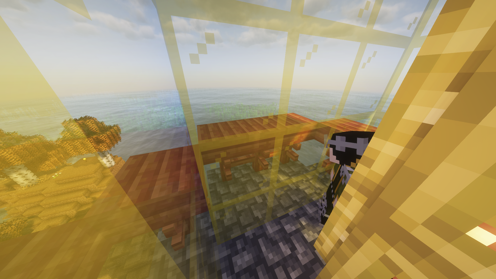
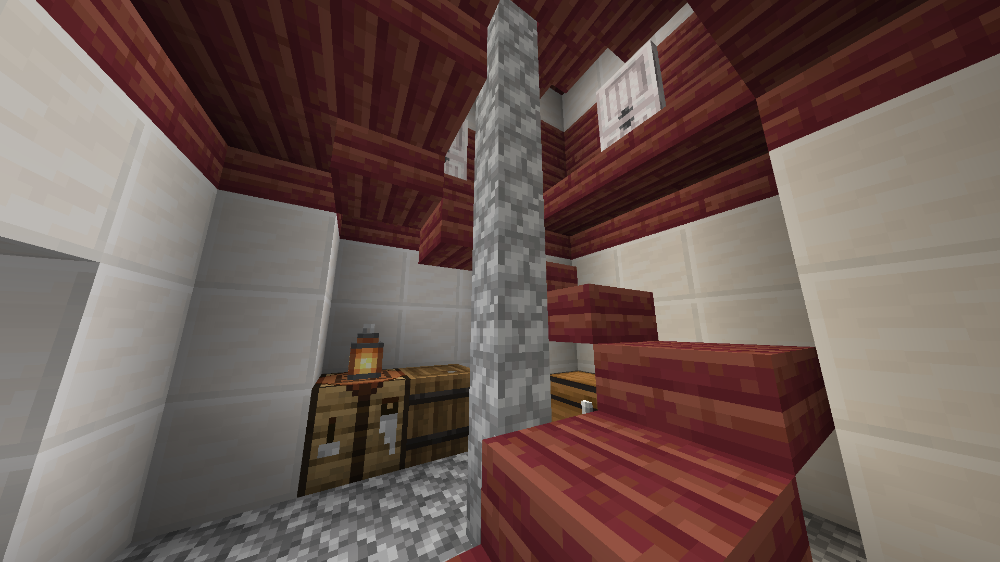
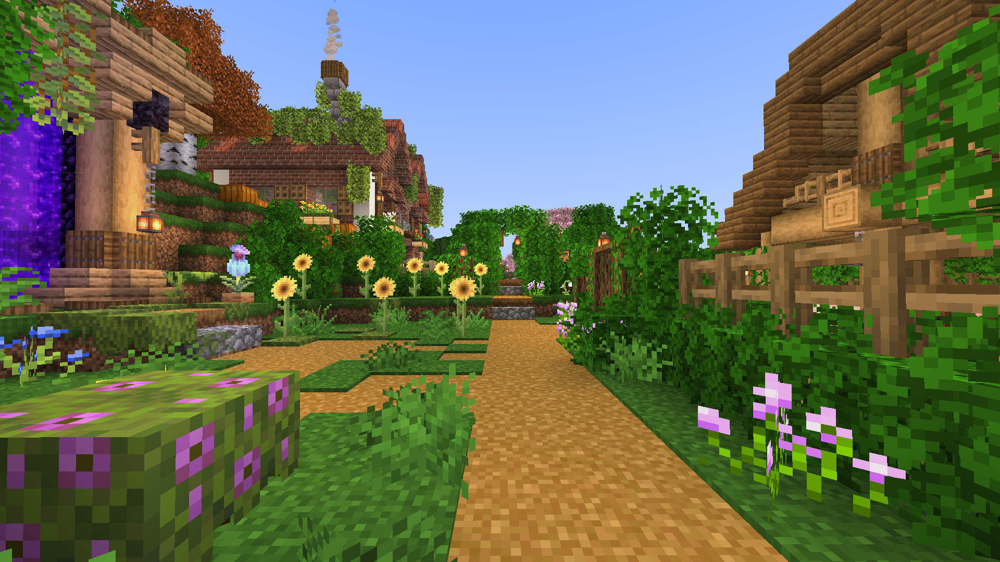
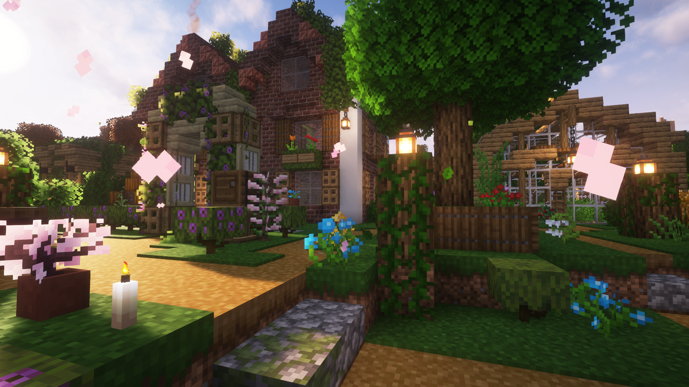
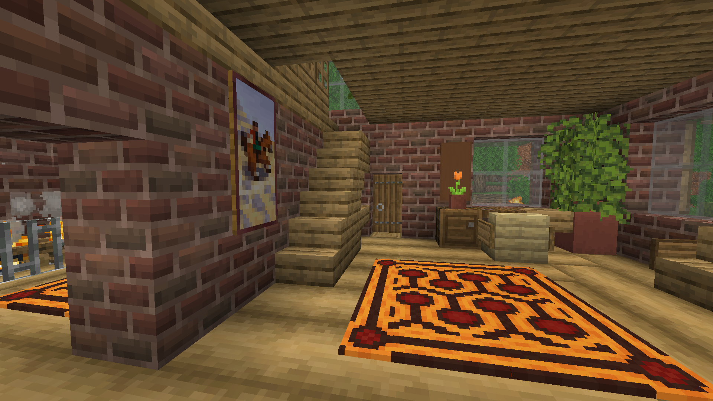
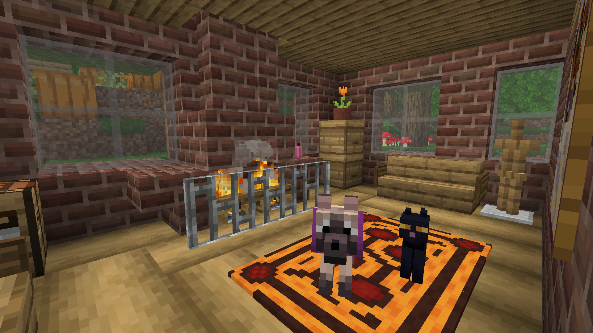
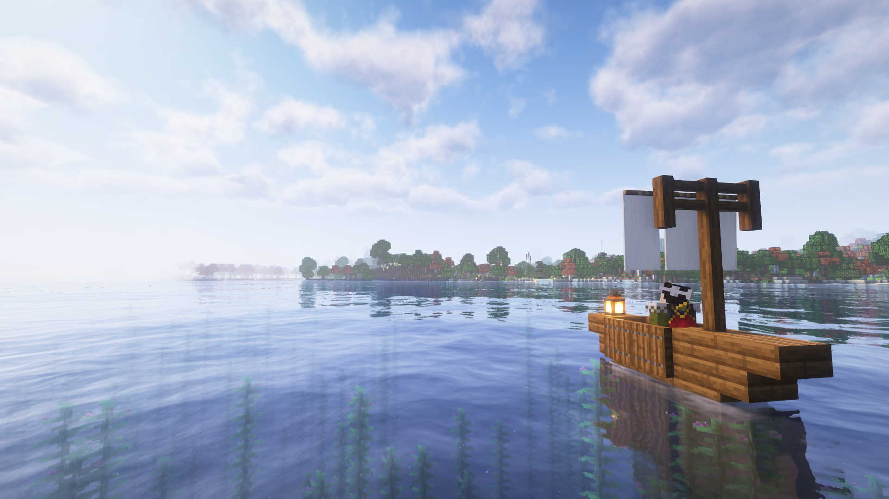

### Cape Birke Lighthouse
A lighthouse was constructed on the coast of Cape Birke,
serving as a landmark for travelers and new settlers.

<figure>

</figure>

### Little Creek Homestead
With a new roof and furnishings,
longstanding renovation plans at Little Creek have finally been completed.
Originally built by C8CAT, the homestead is now tended by Turtlemay
and currently vacant.

<figure>

</figure>

### Community Status
Sadly, as of our eighth month, we no longer have any active builders or community members,
bringing an unceremonious end to our group's first chapter as well as the need for a monthly newsletter.

While there will be no more monthly newsletters, this won't be the end of the blog!
My own building and planning efforts will continue at a leisurely pace
as I focus my efforts on assembling a new group,
and updates will be posted here provisionally.

While the exact future of the community is unclear,
I have pledged to maintain this world for all time
and I thank all those who have contributed so far to my little sanctuary.